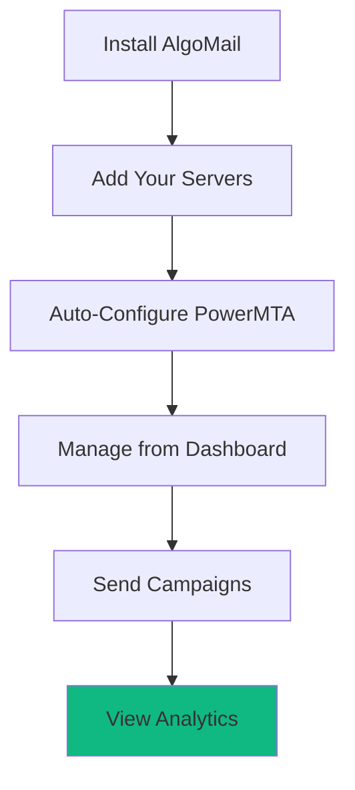
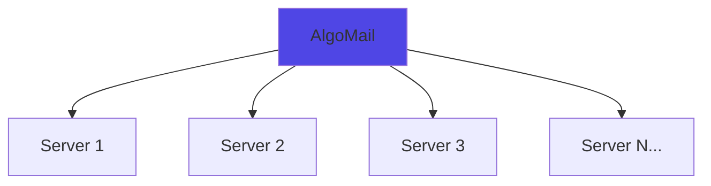
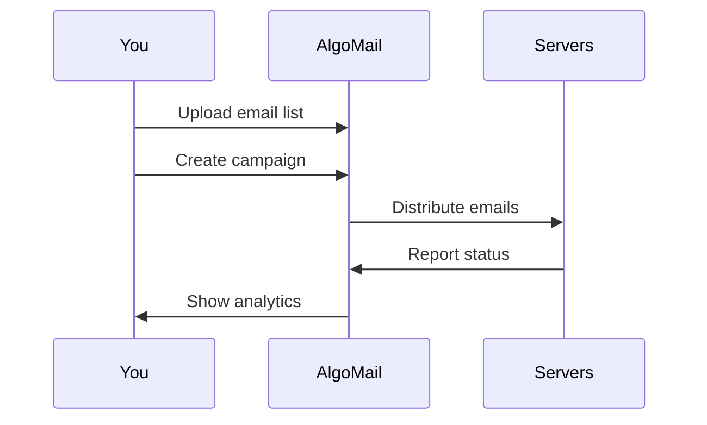
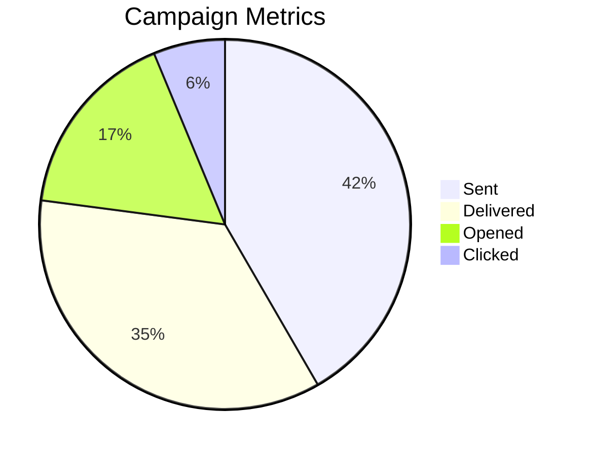
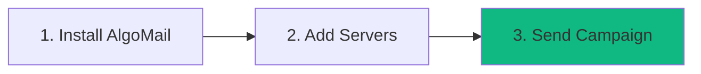

# AlgoMail - PowerMTA Server Management Platform

> **Manage Your PowerMTA Servers. Simple. Powerful.**

---

## What is AlgoMail?

AlgoMail is a **management platform for PowerMTA email servers**. Install PowerMTA on your servers, then manage everything from one dashboard.

Simple as that.

---

## How It Works

**Three main parts:**
1. **Server Setup** - Install PowerMTA automatically on your servers
2. **Campaign Management** - Send and schedule email campaigns
3. **Analytics Dashboard** - Track performance in real-time

---

## Core Features

### 🖥️ **Multi-Server Management**

Manage all your PowerMTA servers from one place:

- Add servers with one click
- Auto-install PowerMTA (v4.5 or v5.0)
- Works on Debian, CentOS, Ubuntu, Rocky Linux, AlmaLinux
- Monitor server health

### 📧 **Campaign Management**

Simple workflow for sending campaigns:

- Upload email lists (CSV/TXT)
- Send from single or multiple servers
- Schedule campaigns
- Pause/resume anytime
- IP rotation across servers

### 📊 **Real-Time Analytics**

See what's happening with your campaigns:

- Live dashboard updates
- Performance by server
- Performance by domain
- Geographic tracking
- Export reports

### ⚙️ **Domain & IP Management**

- Configure domains easily
- Manage DKIM keys
- Assign domains to servers
- Monitor IP reputation

---

## The Workflow

Everything in one dashboard. No jumping between tools.

---

## Who It's For

✅ **Email Service Providers** - Manage client campaigns  
✅ **Marketing Teams** - Run multiple campaigns  
✅ **Agencies** - Handle multiple clients  
✅ **Businesses** - Send promotional emails  

---

## Key Advantages

| Challenge | AlgoMail Solution |
|-----------|------------------|
| Managing multiple PowerMTA servers | One unified dashboard |
| Manual PowerMTA installation | Automatic setup |
| Tracking campaign performance | Real-time analytics |
| Complex configuration | Simple web interface |
| Server monitoring | Built-in health checks |

---

## Platform Overview

### Server Management
- One-click PowerMTA installation
- Automatic configuration
- Health monitoring
- SSH connection testing

### Campaign Tools
- Email list management
- Deduplication
- Scheduling
- Multi-server distribution

### Analytics
- Real-time tracking
- Geographic insights
- Performance metrics
- Detailed reports

### Security
- Self-hosted solution
- User role management
- Secure connections

---

## Getting Started

Most users are sending their first campaign **within 30 minutes**.

---

## Your Infrastructure, Your Control

AlgoMail doesn't host your emails. It **manages your PowerMTA servers**.

- You own the servers
- You control the infrastructure  
- You decide how to scale
- You manage the volume

AlgoMail just makes it **easier to manage everything**.

---

## Simple Pricing Model

- One platform installation
- Works with your existing servers
- No per-email charges from us
- Scale as you need

**You control your costs. You control your growth.**

---

## Why PowerMTA?

PowerMTA is the industry-standard email transfer agent used by professional senders worldwide. AlgoMail makes it **accessible and manageable** through a modern web interface.

---

## Summary

**AlgoMail is a management layer for your PowerMTA infrastructure.**

Instead of:
- SSH-ing into multiple servers
- Editing configuration files manually
- Running commands to check status
- Manually tracking campaigns

You get:
- Web dashboard for everything
- Point-and-click server setup
- Real-time monitoring
- Automated tracking

**One platform. All your PowerMTA servers. Simple management.**

---

*AlgoMail - Professional PowerMTA Server Management*

https://www.algomail.tech/
